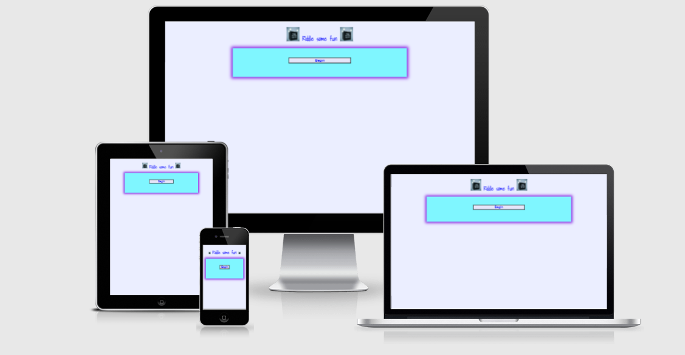
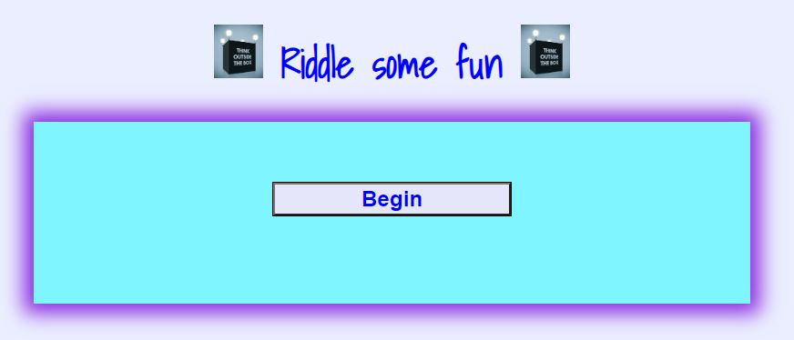

#Riddle some fun
This fun interactive websites lets user answer riddles by multiple choice. It can be used by users of all ages and it gives them a challenge to think about.  
This is the link to the website: https://kat24c.github.io/funquiz/

## Features
### * Navigation
* The beginning page is a button to start the riddles. 
* Once you have clicked the begin button it takes you to the riddles. 
* There are eight riddles at present, more can be added when needed. 

### * Styling
* Title in a dark blue, with a think outside image before and after the title. 
* The  background is a very pale blue/lavendar colour and in the center is a light blue   container with a blueviolet box shadow. 
* The begin button has blue writing with a lavender background and a black border. 
* I used mycolor.space to choose the colours. 

## * Riddle questions 
 * The question is centerised and in blueviolet. 
 * The answers are mulitple choice and when you hover over them they change to a blueviolet background with light blue writing. 

## * Score 
* At the bottom of the container are 8 squares. When the answer right the square will turn carribean green and when the answer is wrong the square will turn #A43563. 
* The last page will show the score with a message: You got 4 out of 8. Good Try.
* THe restart button will take you back to the beginning page.  
