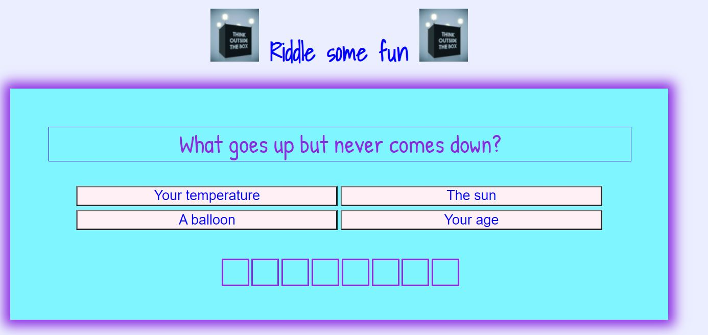
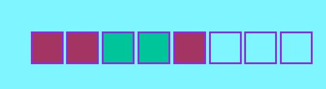
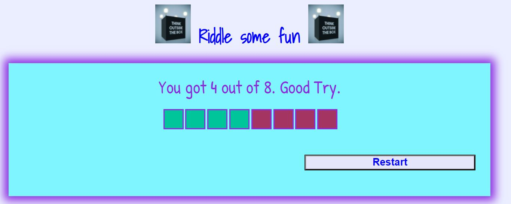
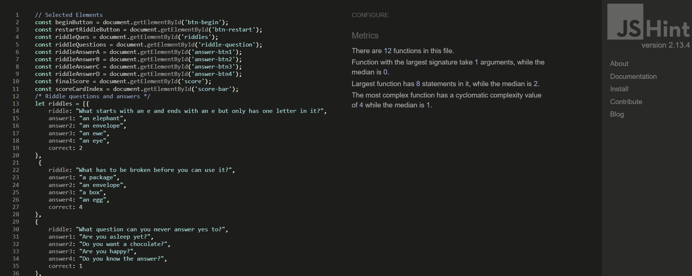
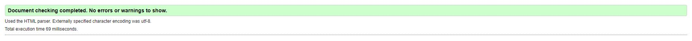
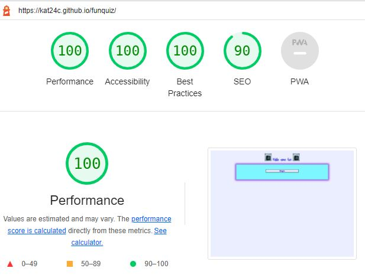
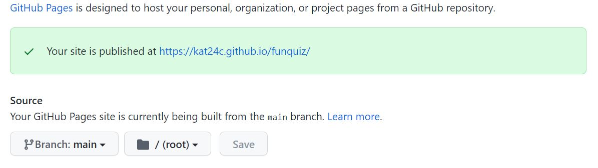

# Riddle some fun
This fun interactive websites lets user answer riddles by multiple choice. It can be used by users of all ages and it gives them a challenge to think about.  
This is the link to the website: https://kat24c.github.io/funquiz/

### User Stories
* The user wants some fun exciting riddles to challenge their minds. 
* The user wants to see if they got the riddle right or wrong. 
* The user wants to be able to see their final score at the end of the game. 
* The user wants to be able to restart the game with ease. 

## Features
### Navigation
* The beginning page is a button to start the riddles. 
* Once you have clicked the begin button it takes you to the riddles. 
* There are eight riddles at present, more can be added when needed. 

### Styling
* Title in a dark blue, with a think outside image before and after the title. 
* The  background is a very pale blue/lavendar colour and in the center is a light blue   container with a blueviolet box shadow. 
* The begin button has blue writing with a lavender background and a black border. 
* I used mycolor.space to choose the colours. 

## Riddle questions 
 * The question is centerised and in blueviolet. 
 * The answers are mulitple choice and when you hover over them they change to a blueviolet background with light blue writing. 

## Score 
* At the bottom of the container are 8 squares. When the answer right the square will turn carribean green and when the answer is wrong the square will turn #A43563. 
* The last page will show the score with a message: You got 4 out of 8. Good Try.
* The restart button will take you back to the beginning page.  

### Testing
* I tested the pages in different browsers including Edge, Chrome and Brave.
* I tested the page using a samsung A70 mobile.  
* I used devtools to confirm that this project is responsive, looks good and functions on different screen sizes. 

### User Story Testing
* The user is able to begin the game with ease and answer some fun riddles. 
* The user is able to see if they got the answer right or wrong by looking at the scorebar. 
* The scorebar will turn shade of green when the answer is right and a shade of red when the answer is wrong. 
* The user is able to restart the riddles with ease by pressing the restart button. 

### Bugs
  * When running the code I noticed the final score show as 6 out of 0. 
  * I fixed this by adding the variable let finalTotal = riddles.length.

### Validation
* By running my project through lighthouse in devtool, I confirmed that the colours and fonts are easy to read and accessible. 
* CSS
  * No errors were found when running the css code through jigsaw W3C code validator
* HTML
  * No errors were found when running the html code through validator W3
* JavaScript
  * No errors were found when running the javaScript code through JsLint.  
* Accessibility
  * By running my project through lighthouse in devtool, I confirmed that the colours and fonts are easy to read and accessible. 
  
 
 
 
 

## Deployment
  * The site was deployed through Github pages: 
     * Using git add . , git commit -m and git push to upload the content to the github repository. 
     * In the github pages navigate to settings. 
     * From the drop down menu change branch to main. 
     * Once the main branch has been selected, the page will provide a link to the completed website. 

 

 ## Credits
 * The container code was adapted from Spencer Barriball, Mentor.

## Media
* The image Think outside the box was taken from pexels.com.
* The riddles were taken from https://parade.com/947956/parade/riddles/.
